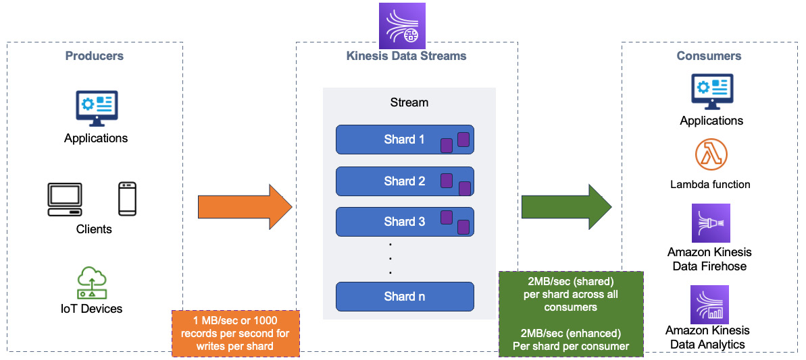

### STS—Security Token Service
Limited and temporary access to AWS (up to 1 hour)
- AssumeRole — assume roles within your account
- AssumeRoleWithSAML — returns credentials for users logged with SAML
- GetSessionToken - MFA
- GetFederationToken — temporary creds for a federated user
- GetCallerIDentity - returns details about the IAM user or role in API call
- DecodeAuthorizationMessage — decodes error message when AWS API is denied.

### STS to assume role:
* Define an IAM role, 15 mins to 1 hour
* support cross-account access with STS with MFA - GetSessionToken from STS

### Advanced IAM
default - DENY
IAM policies & S3 Bucket Policies - IAM + S3 = total policy (Union)

### Dynamic Policies with IAM
e.g. Need to assign each user a /home/<user> folder in S3 bucket

* Option 1: Create IAM policies allowing for each user his/her folder, e.g. /home/sarah, /home/brian, etc.
  One Policy per user does not scale
* Option 2: Use Dynamic policy. `policy variable  home/${aws:username}/`

### Inline vs. Managed policies
* Managed - only AWS can change. Good for admins
* Custom managed — you can change them, reusable, can be applied to many principals
* Inline — Strict one-to-one relationship between policy and principal. **Policy deleted when IAM principal removed.**
  * Restricted in size, cannot define a lot of resources.

### Passing a role to a service
iam:PassRole permission to pass to another service
iam:GetRole to view the role being passed
**Roles can only be passed to what was trusted**

### Microsoft AD
* AWS Managed Microsoft AD - Users are located in AD and in AWS. **Supports MFA**
* AD Connector — like a proxy. Limitation up to 5000 users
* Simple AD — without integration with Windows. Hosted in AWS.

### AWS other services
#### SES: Simple Email Service. Send + receive emails.
#### OpenSearch — use with DB to search + analitic queries
* Managed cluster + serverless cluster
* Does not support SQL
* CloudWatch logs + OpenSearch

#### Athena
* Analyze data by SQL language
* load to S3 and use Athena from S3
* Supports CSV
* Price: $5 per TB
* Used with Quicksight for reports
* **Use cases:** analytics, reports, query logs
* **Exam** : analyze data in serverless -> Athena
* **Exam**: Performance improvement: use columnar data: Apache Parquet, ORC, Use Glue to convert data to ORC, Parquet
  * Compress data
  * Partition datasets in S3
  * Use larger files (> 128 mb)
* Federated query

#### Amazon Managed Streaming for Apache Kafka
* alternative to Kinesis
  Kinesis       |     Amazon Kafka
  message limit

#### Certificate Manager (ACM)
* Manage SSL/TLS Certificates
* Private certificates: X.509, cannot be deployed on the internet, used internally.

#### Amazon Macie
* Checks sensitive data via ML, alerts.

#### App Config
* Configure, validate, deploy dynamic configurations, rollback

#### Cloudwatch Evidently
* validate feature to provide it to a specified % of your users
* **Use cases:** Launches, feature flags. Expiriments, compare versions.
* Overrides - pre-define a feature for a specific user

## AWS Security
* In-flight encryption: TLS/SSL - TLS certificates used(HTTPS).
* Server-side encryption at rest: encrypted after recieving, decrypted before sending. Stored in an encrypted form.
* Client-side encryption - Envelope Encryption

### KMS - Key management service
AWS manages encryption - **default**
* Able to audit KMS key via CloudTrail
* KMS through API calls, store encrypted keys in env/code
#### KMS Keys Types
* Customer Master Key
* Symmetric(AES-256) — used by AWS services
* Asymmetric — (RSA, ECC key pairs): public + private

#### Types of KMS keys
* AWS owned(free): SSE-S3, SSE-SQS, SSE-DDB (default)
* AWS managed (free): aws/service-name, e.g., aws/rds, aws/ens
* Customer managed keys _created_ in KMS: $1/month
* Customer managed keys _imported_ in KMS: $1/month
* pay for API call to KMS
* Key rotation: every 1 year
* Customer managed KMS key: automatic, on demand rotation
  Saved **per region**. Migrate: create EBS snapshot, use ReEncrypt with KMS key B
* KMS Key policies:
  * default — everyone can access an account
  * Custom key policy — define who can access the Key for cross-account

#### EXAM Security
- if on-premises needs to have access - create a programmatic access user
- GenerateDataKeyWithoutPlainText - generates not immediately DEK
- CloudHSM - hardware security modules
- Throttling: use DEK caching or contact AWS to increase, or through API

# AWS Global Infrastructure
- AWS region: Geographical locations where AWS hosts its data centers
- Availability Zone: small groups of data centers that are logically and physically separated 
by a distance that falls within 100 kilometers (km) (60 miles) of each other.

# Security
- AssumeRole API method - it is possible to set a time limitt on the role session using DurationSeconds argument
max: 12 hours
## KMS Encryption
- KMS keys (CMK) - only encrypt data up to 4KB
- plain text data key - is downloaded together with an encrypted data key. Plain text DK should not be stored.
- x-amz-server-side-encryption - when AWS managed key is used,
  - for custom managed keys (SSE-C), it is required to specify algorithm and custom key 

# DynamoDB
- Global secondary index. 
  - **Can be created at any time**. 
  - It Can be considered as a different partition key + sort key
  - No limitations of the size
  - Only eventual consistency is supported.
- Local secondary index. 
  - Contains the same partition key but different sort key
  - Limitation up to 10 GB per partition
  - It can be only created on table creation
  - Maximum 5 LSI per table
# Kinesis

## Kinesis Data streams
- By default, data is stored for 24 hours. It can be increased up to 365 days by **IncreaseStreamRetentionPeriod**
- Shards
  - Writes capacity: 1MB/sec, 1000 records/sec, per shard
  - Read capacity: 2MB/sec, 1000 records/sec, per shard. Shared fanout: all consumers share a shard 2mb/sec. 
    - Enhanced fanout type: 2MB for each consumer.
- 
- Data is stored as records, max 1MB.
- PutRecords, PutRecord tu put data into stream
- Capacity modes:
  - On-demand - 4MB/sec, 4000 records/sec. It Can scale up to 200MB/sec, 200.000 records/sec
  - Provisioned - you need to specify the number of shards, you can increase(split)/decrease(merge) shards.

# Lambda
- Lambda authorizers
  - token-based, e.g., JWT or OAuth token
  - parameter-based - receive the caller's identity via headers, query strings, etc.